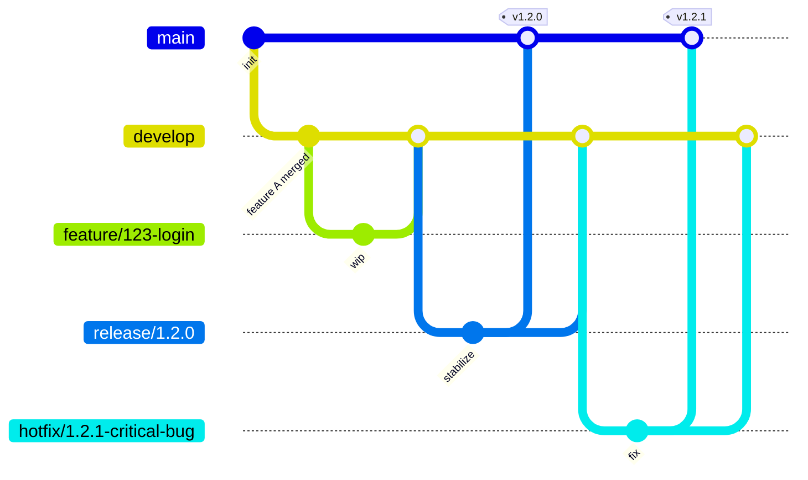
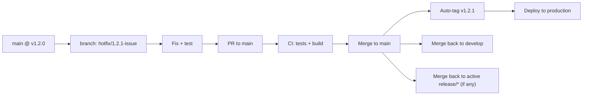

# CI/CD Pipeline Guide for Development Teams

> **Status:** Draft — to be amended with team/repo-specific details
> **Owner:** DevOps Lead
> **Audience:** Development team (all engineers)

---

## 1. Quick Reference (TL;DR)

| I want to... | Do this |
|---|---|
| Start a new feature | Branch `feature/<ticket-id>-short-desc` from `develop` |
| Fix a bug found in QA | Branch `bugfix/<ticket-id>-short-desc` from `develop` |
| Fix a bug in **production** | Branch `hotfix/<ticket-id>-short-desc` from `main` (latest release tag) |
| Cut a release | DevOps/Release Manager branches `release/x.y.0` from `develop` |
| Trigger a version bump | Merge to `release/*` or `main` — CI bumps automatically based on commit type |
| Know which branch is deployable | `main` = production, `release/*` = staging/UAT, `develop` = integration/dev env |

**Golden rule:** Never commit directly to `main`, `develop`, or `release/*`. Everything goes through a Pull Request.

---

## 2. Branching Model

We follow a **GitFlow-inspired** strategy — industry standard for teams with scheduled releases and the need to support hotfixes independently of in-progress development.

### Branch Roles

| Branch | Purpose | Protected? | Deploys to |
|---|---|---|---|
| `main` | Always reflects production-ready code; every commit is a tagged release | Yes | Production |
| `develop` | Integration branch; latest delivered features for next release | Yes | Dev/Integration env |
| `release/x.y.0` | Stabilization branch before a release; only fixes, no new features | Yes | Staging/UAT |
| `feature/*` | New feature work | No | Ephemeral/PR preview |
| `bugfix/*` | Non-critical fixes targeting `develop` | No | Ephemeral/PR preview |
| `hotfix/*` | Emergency fixes targeting `main` directly | No | Hotfix preview env |

---

## 3. Standard Flow: Feature → Production

1. **Branch:** Create `feature/<ticket-id>-desc` from `develop`.
2. **Develop:** Commit using [Conventional Commits](https://www.conventionalcommits.org/) (see §4) — this drives automated versioning later.
3. **Open PR → `develop`:** CI runs automatically:
   - Lint / static analysis
   - Unit tests
   - Build
   - (Optional) SAST / dependency scan
4. **Review & merge:** Requires N approvals + green CI. Squash-merge recommended to keep `develop` history clean.
5. **Release cut:** When `develop` is ready, DevOps/Release Manager branches `release/x.y.0` from `develop`.
   - Only bug fixes go into `release/*` from this point (code freeze for features).
   - QA/UAT validates against this branch.
6. **Release merge:** `release/x.y.0` is merged into **both** `main` (triggers production deploy + tag) and back into `develop` (so fixes made during stabilization aren't lost).
7. **Tag & deploy:** CI tags `main` with the new version and triggers the production deployment pipeline.

---

## 4. Versioning Strategy

We use **Semantic Versioning (SemVer): `MAJOR.MINOR.PATCH`**

| Bump | Triggered by | Example |
|---|---|---|
| **MAJOR** | Breaking change — commit footer `BREAKING CHANGE:` or `!` after type | `feat!: remove legacy auth endpoint` |
| **MINOR** | New backward-compatible feature — commit type `feat:` | `feat: add CSV export` |
| **PATCH** | Backward-compatible bug fix — commit type `fix:` | `fix: correct null pointer in cart total` |

- Version bump is **automated** by CI on merge to `release/*` / `main` (e.g., via `semantic-release`, `standard-version`, or equivalent — *confirm tool with DevOps*).
- Version lives in: `<confirm: package.json / VERSION file / Helm chart / pom.xml>` — single source of truth, updated by CI, never edited manually.
- Every merge to `main` produces a Git tag `vX.Y.Z` and a changelog entry.

> **Action for amendment:** Insert the actual commit-lint config / version-bump tool used in your pipeline here.

---

## 5. Hotfix Flow (Production Emergency)

Use this **only** for critical production issues that can't wait for the next scheduled release.

**Steps:**
1. Branch `hotfix/<ticket-id>-desc` from `main` (the current production tag).
2. Fix, test locally, push.
3. Open PR → `main`. CI runs full suite — hotfixes are **not** exempt from quality gates.
4. On merge: auto-tag (PATCH bump), deploy to production.
5. **Critical:** Merge the same fix back into `develop` (and any active `release/*` branch) — otherwise the bug reappears in the next release.

> **Why this matters:** The #1 cause of "the bug came back" incidents is skipping the merge-back step.

---

## 6. CI Pipeline Stages (per PR)

| Stage | What happens | Blocking? |
|---|---|---|
| Lint | Code style / static analysis | Yes |
| Unit tests | Fast, isolated tests | Yes |
| Build | Compile / package artifact | Yes |
| Security scan | Dependency / SAST scan | Yes (or warn-only — *confirm*) |
| Integration tests | Run on `develop`/`release` merges | Yes |
| Version bump + tag | Only on `release/*` → `main` | N/A |
| Deploy | Environment-specific (dev/staging/prod) | N/A |

---

## 7. FAQ / Common Gotchas

**Q: I merged a feature into `release/x.y.0` by mistake — what now?**
A: Cherry-pick is risky; flag to DevOps immediately. Release branches should only receive fixes during stabilization.

**Q: My version didn't bump after merge.**
A: Check your commit message follows Conventional Commits format. Bump is driven by commit type, not by merging itself.

**Q: There are two `release/*` branches active — which do I target?**
A: Only one release should be in stabilization at a time. If you see two, flag it — likely a process gap.

**Q: Can I deploy a `feature/*` branch directly to production?**
A: No. All production deploys go through `main`, sourced from a tagged release or hotfix.

---

## 8. Open Items to Confirm Before Finalizing

- [ ] Confirm actual branch naming conventions match team's existing convention
- [ ] Insert CI tool specifics (Jenkins/GitHub Actions/GitLab CI) and pipeline file location
- [ ] Confirm version-bump automation tool and config
- [ ] Confirm approval count / CODEOWNERS rules per branch
- [ ] Add links to: PR template, commit lint config, deployment runbook
- [ ] Add diagram of environments (dev/staging/prod) mapped to branches

---

*This document is intended to live in the repo at `/docs/ci-cd-pipeline-guide.md` and be updated alongside any pipeline changes.*
